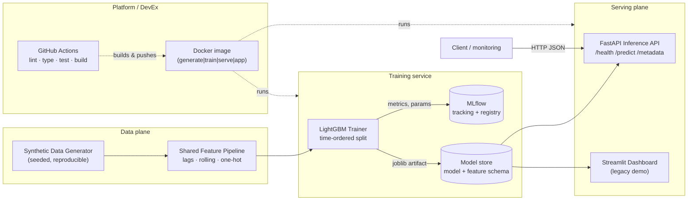
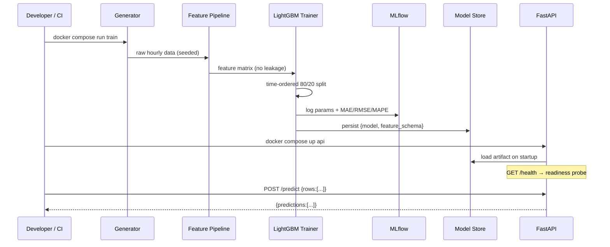

# Real-Time Retail Demand Forecasting — Production MLOps Pipeline

[](https://github.com/minhazda/synthetic-retail-mlops-pipeline/actions/workflows/ci.yml)
[](https://codecov.io/gh/minhazda/synthetic-retail-mlops-pipeline)


Production-grade MLOps pipeline that forecasts hourly retail demand from
**privacy-preserving synthetic data** using LightGBM. This repository takes an
MSc dissertation (*"Real-Time Retail Demand Forecasting Using Synthetic Data"*
— graded 70%; the dissertation reported a 37% MAE reduction and 11.7% MAPE) and
re-engineers it to the standards hiring teams expect: containerized, tested,
type-checked, tracked with MLflow, served behind a real-time API, and shipped
through CI/CD. Metrics in [Results](#results) are this pipeline's own measured,
reproducible numbers — not inherited claims.

> **Author:** Md Minhazur Rahman · MSc Data Science, University of Greenwich
> · [Live prototype](https://retail-forecasting-hvdzvesi4u9l6fs5tvdoyi.streamlit.app/)

---

## Why this exists

The original dissertation lived as a single training script plus a Streamlit
demo. It produced strong results but, like most academic code, it hard-coded
paths, shipped no tests, pinned no dependencies, and could not be reproduced or
deployed. This project closes that gap: **one reproducible pipeline** that
generates data, trains and registers a model, and serves predictions — all
runnable with a single command.

A key reconciliation was made: the dissertation script trained a Random Forest
on hourly data while the Streamlit prototype generated its own daily data. Both
are now unified onto a **single canonical pipeline** — LightGBM on hourly,
per-SKU data — with **one shared feature module** used identically in training
and serving to eliminate training/serving skew.

---

## Architecture



### Request / training data flow



---

## Project structure

```
01-synthetic-mlops-pipeline/
├── src/retail_forecasting/
│   ├── config.py              # Typed, YAML-driven config (no hard-coded paths)
│   ├── exceptions.py          # Custom exception hierarchy
│   ├── logging_config.py      # Structured JSON logging (structlog)
│   ├── features.py            # Single shared feature pipeline (train == serve)
│   ├── train.py               # LightGBM training + MLflow + artifact persistence
│   ├── data/generate.py       # Seeded, reproducible synthetic data generator
│   ├── api/main.py            # FastAPI real-time inference service
│   └── app/streamlit_app.py   # Legacy Streamlit prototype
├── tests/                     # pytest: generator, features, API, train metrics
├── configs/config.yaml        # Central configuration
├── docker/entrypoint.sh       # Role switch: generate | train | serve | app
├── Dockerfile                 # Multi-stage, non-root, healthcheck
├── docker-compose.yml         # Local stack: train · api · dashboard · mlflow
├── .github/workflows/ci.yml   # CI/CD: lint → type → test → build → smoke
├── pyproject.toml             # ruff · black · mypy · pytest config + packaging
├── requirements.txt           # Pinned runtime deps
└── requirements-dev.txt       # Pinned dev/CI deps
```

---

## Quickstart

### Option A — Docker Compose (recommended)

```bash
# 1. Train: generates synthetic data, trains LightGBM, logs to MLflow
docker compose run --rm train

# 2. Serve the real-time inference API on http://localhost:8000
docker compose up api

# 3. (optional) MLflow UI on http://localhost:5000, dashboard on :8501
docker compose up mlflow dashboard
```

```bash
# Predict (after training)
curl -s http://localhost:8000/health
curl -s -X POST http://localhost:8000/predict \
  -H 'Content-Type: application/json' \
  -d '{"rows": [{"stock_level": 190, "promo_flag": 0, "foot_traffic": 52, "hour": 12, "day_of_week": 2, "sales_lag_1h": 1, "sales_lag_24h": 2, "sales_lag_7d": 1, "sales_roll_3h": 1.3, "stock_lag_1h": 191, "weather_Cold": 0, "weather_Rainy": 0, "weather_Snowy": 0, "weather_Sunny": 1, "category_Dairy": 0, "category_Fresh Produce": 1, "category_Snacks": 0}]}'
```

### Option B — Local Python

```bash
python -m venv .venv && source .venv/bin/activate
pip install -r requirements-dev.txt && pip install -e .

python -m retail_forecasting.data.generate    # write synthetic raw data
python -m retail_forecasting.train             # train + persist model
uvicorn retail_forecasting.api.main:app --reload   # serve API
```

---

## The single Docker image, four roles

The same image runs every stage; the first argument selects the role
(see `docker/entrypoint.sh`):

| Command | Action |
|---------|--------|
| `generate` | Write a reproducible synthetic raw dataset |
| `train` | Build features, train LightGBM, log to MLflow, persist artifact |
| `serve` *(default)* | Start the FastAPI inference API (`:8000`) |
| `app` | Start the Streamlit dashboard (`:8501`) |

```bash
docker build -t retail-forecasting .
docker run --rm -v "$PWD/models:/app/models" retail-forecasting train
docker run --rm -p 8000:8000 -v "$PWD/models:/app/models:ro" retail-forecasting serve
```

The build is **multi-stage** (wheels compiled in a builder, copied into a slim
runtime), runs as a **non-root** user, and ships a `HEALTHCHECK` against
`/health`. Datasets and model artifacts are mounted at runtime — never baked
into the image (`.dockerignore` keeps the build context small).

---

## Configuration

All behaviour is driven by `configs/config.yaml` (override the active file with
the `RF_CONFIG` env var). Nothing is hard-coded in business logic — paths,
generator parameters, hyperparameters, and MLflow settings all live in config.

---

## Quality gates

| Tool | Purpose |
|------|---------|
| **ruff** | Linting + import ordering |
| **black** | Deterministic formatting |
| **mypy** | Static type checking (all functions are typed) |
| **pytest** + coverage | Unit tests for generator, features, API, and train metrics |
| **pre-commit** | Runs the above on every commit |

```bash
ruff check src tests && black --check src tests && mypy src && pytest
```

The test suite covers reproducibility (identical output per seed), schema
validation, **leakage guards** (per-SKU lags never borrow across SKUs or look
ahead), the metric/baseline logic behind the headline numbers, and the API's
degraded (no-model) and happy paths.

---

## CI/CD (GitHub Actions)

On every push and pull request, `.github/workflows/ci.yml` runs three jobs:

1. **quality** — ruff, black, mypy, pytest with coverage.
2. **docker** — build the image with Buildx layer caching; on `main`, push to
   GHCR with semantic tags (`latest`, branch, short SHA).
3. **smoke** — run the built image's `train` command end-to-end on synthetic
   data, proving the whole pipeline works in a clean container with no external
   dependencies.

---

## Results

All figures below are produced by **this repository's own pipeline** — run
`python -m retail_forecasting.train` (or `docker compose run --rm train`) to
reproduce them; they are logged to MLflow on every run. LightGBM is trained on
a **time-ordered 80/20 split** (101,760 train / 25,440 test hourly rows, 19
features) with per-SKU lag, rolling-mean, calendar, weather, and promotion
features and strict no-look-ahead leakage guards, then compared against a
**seasonal-naive baseline** (previous-day, same-hour value):

| Metric | LightGBM | Seasonal-naive baseline | Improvement |
|--------|---------:|------------------------:|------------:|
| MAE    | **0.530** | 0.895 | **−40.8%** |
| RMSE   | **0.702** | 1.332 | **−47.3%** |
| MAPE   | 41.0%    | 68.3% | — |

**How to read these numbers.** The target (`sales_volume`) is a low, sparse
hourly count (mean ≈ 0.87 units per SKU-hour), so percentage-error metrics like
MAPE are inflated by near-zero denominators and make a poor headline on this
data. The model's **40.8% MAE / 47.3% RMSE reduction over the naive baseline**
is therefore the meaningful, scale-robust result. These are the pipeline's own
measured values; the source dissertation separately reported a 37% MAE
reduction and 11.7% MAPE on its setup, and this re-engineered pipeline lands in
the same regime for *relative* improvement while measuring everything
reproducibly and logging it to the MLflow registry (`retail-lgbm`).

---

## Roadmap

This is deliverable **1–4** (Dockerization, MLflow, CI/CD, docs) of a four-week
production build. Next:

- Feature store (Feast or custom) for the synthetic features.
- Promote the FastAPI service from scaffold to the primary serving surface,
  retiring the Streamlit prototype.
- Data-drift monitoring + alerting (Evidently / Prometheus + Grafana).
- Infrastructure-as-Code (Terraform) for cloud deployment.

---

## License

MIT © Md Minhazur Rahman
